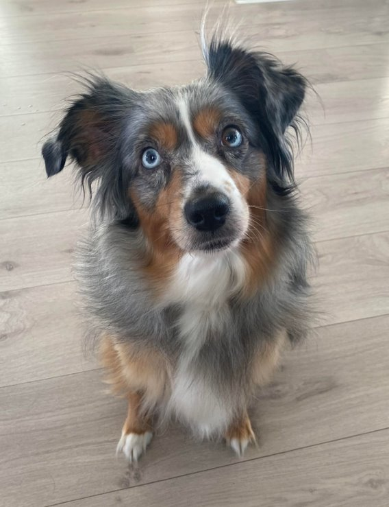

# Cattle, not pets

"Cattle, not pets" is a commonly used analogy meant to explain architectural patterns in the Cloud.
Here we are making use of it to explain some of the use case for a container, in contrast to a Virtual Machine.

Microservice-based architectures commonly uses Containerization, while a monol

## The pet

This is our pet, Pernille. She is precious, and we spend a lot of time, effort and money to keep her healthy and happy.
She is a house pet, and  she needs a lot of care and attention. She has her own bed, her own food and her own shampoo, that is dedicated only to her.

Imagine, if you will, that Pernille suddenly falls ill. The family are going to be devastated, and of course spend a lot of money and  time to make sure she recovers.

If she __did__ die, we would no longer have a pet, and of course everyone would be devastated.

If we were ever to get a new pet, a lot of cost and time is attached to raise this new pet, as well as getting them vaccinated, etc.

## The "Cattle"

*(Yes, these are not cattle. At this point i just want to show of these Goats we have.
Think of them as Cattle for the analogy's sake. :))*

On the other hand, imagine we have a farm, where we have some free-roaming goats. 

The Goats that live on our property are very self-sufficient.

They eat grass, and we don't spend a lot of effort, time or money to keep them healthy.

They still need some basic facilities, such as a shelter from rain, but not nearly as much as the pet.

If one of the cattle fall ill, you would usually not spend very much money or effort to keep it alive. 

(Of course, I dont want that to happen either!)

The operations of the entire farm is not dependent on just one animal. If one animal dies, we are able to continue mostly as normal, usually replacing this animal with another one.

## We dont want Pets, we want cattle

So, in this analogy, the pet is refering to one or more servers.
The cattle are microservices, in the form of Containers.

Usually a Virtual Machine is costly and time-consuming to set up and maintain. Automation around this exist, but the point is that a Virtual Machine inherently needs maintenance to remain Safe, Updated and consistent with the environment it is meant for.
If the system is not structured with High-Availability or Redundancy in mind, a single server fault could risk bringing the whole system down.

Even if we set up multiple servers to provide HA or redundancy, the time and effort spent to maintan and set these servers up, are huge.

In a architecture based around "Cattle", we usually refer to Containers. Containers are super easy to get up and running, and they are easilly run in sets of 2 or more, and loadbalanced to avoid single points of failure.

Since containers are pre-packaged, prerequisites dont need to be set up, and we dont spend time maintaining the containers themselves.