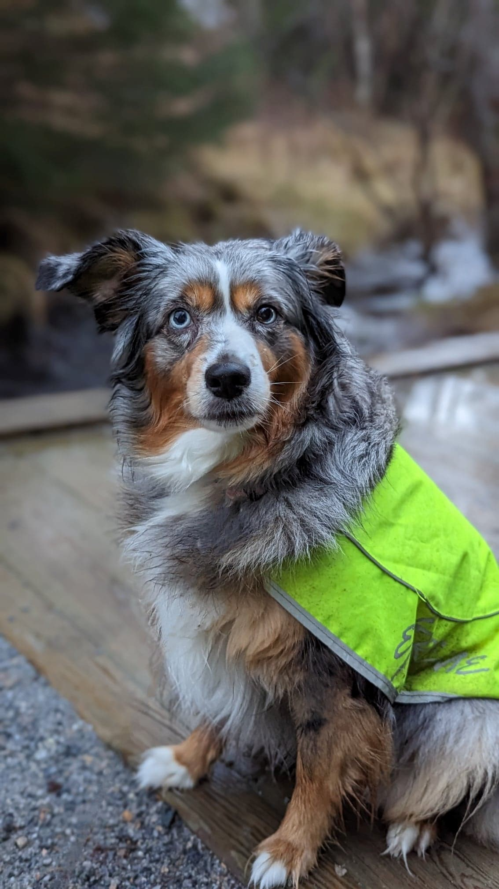
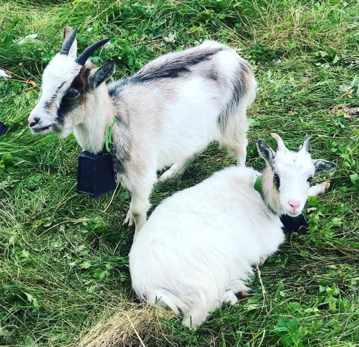

# Cattle, not pets

"Cattle, not pets" is a commonly used analogy meant to explain architectural patterns in the Cloud.
Here we are making use of it to explain some of the use cases for a container, in contrast to a Virtual Machine.

Microservice-based architectures commonly use Containerization, while a monolithic application is commonly on a Virtual Machine. We will not go further into Microservices here, but "Cattle, not pets" is a core idea there.

## The pet - the Virtual Machine

This is our pet, Pernille. She is precious, and we spend a lot of time, effort and money to keep her healthy and happy.
She is a house pet, and she needs a lot of care and attention. She has her own bed, food and shampoo dedicated only to her.

Imagine, if you will, that Pernille suddenly falls ill. The family is going to be devastated, and of course, spend a lot of money and time to make sure she recovers.

If she __did__ die, we would no longer have a pet, and of course, everyone would be devastated.

If we were ever to get a new pet, a lot of cost and time is attached to raising this new pet, as well as getting them vaccinated, etc.

## The "Cattle"

*(Yes, these are not cattle. I just want to show these Goats <3)*
Think of them as Cattle for the analogy's sake. :))

On the other hand, imagine we have a farm, where we have some free-roaming goats.

The Goats that live on our property are very self-sufficient.

They eat grass, and we don't spend a lot of effort, time or money to keep them healthy.

They still need some basic facilities, such as a shelter from rain, but not nearly as much as a pet.

If one of the cattle fall ill, you would usually not spend very much money or effort to keep it alive.

(Of course, I dont want that to happen either!)

The operations of the entire farm is not dependent on just one animal. If one animal dies, we are able to continue mostly as normal, usually replacing this animal with another one.

## We dont want pets, we want cattle

So, in this analogy, the pet is refering to servers.
The cattle are microservices, in the form of containers.

Usually, a Server is costly and time-consuming to set up and maintain. Automation around this exist, but the point is that a Virtual Machine inherently needs maintenance to remain Safe, Updated and consistent with the environment it is meant for.

They are typically set up manually and are in turn prone to errors and misconfigurations.
If the system is not structured with High-Availability or Redundancy in mind, a single server fault could risk bringing the whole system down.

Even if we set up multiple servers to provide HA or redundancy, the time and effort spent to maintan and set these servers up, are huge.

In architecture based around "Cattle", we usually refer to Containers. Containers are easy to get up and running, and they are easily run in sets of multiple containers to avoid single points of failure.

Containers are not set up individually or manually, and we usually don't have an awarness to any single pod, they are numbered, such as any single animal in a herd would be.

Since containers are pre-packaged, prerequisites don't need to be set up beforehand, and we don't spend time maintaining the containers themselves.

Errors is often resolved by restarting or killing the pod, to restore its initial, working state. Just this example is an extreme time and cost saver contrary to troubleshooting a specific server or service on a specific service.
