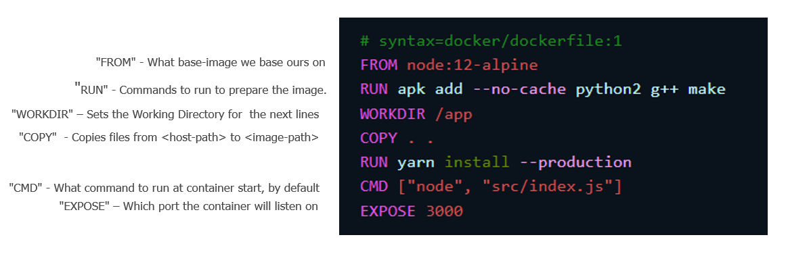
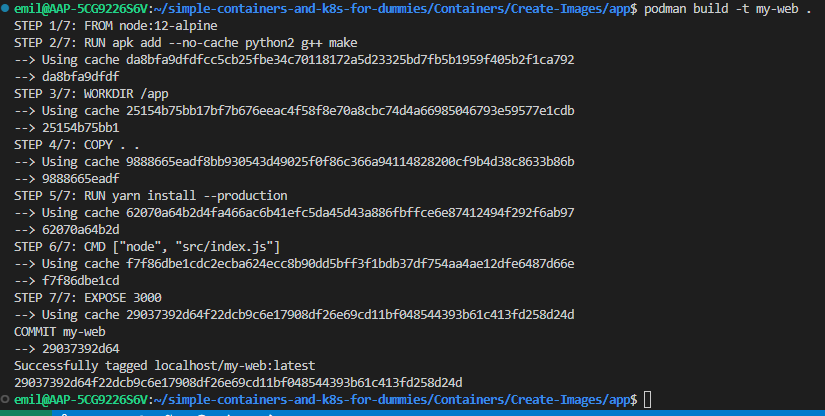
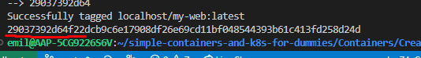
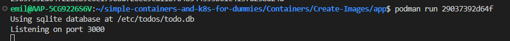
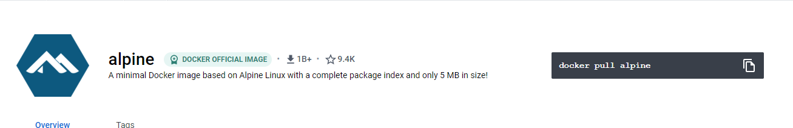

# Creating Container Images

As we touched upon in the previous chapter, a Container Image is a immutable file that contains a snapshot of a environment.

We usually refer to an Image as either a base image or as a child image. For the most part you will develop child images. These images make use of another image as a baseline. This reduces complexity, while allowing for any needed customizaton.

## Prerequisites

While Docker is well known for many, and is in large parts responsible for the the advances in containerization, we will make use of  [Podman](https://docs.podman.io/en/latest/index.html) as our container runtime and build tool for this tutorial.

Podman is free and easy to use. The workflow attached to Containers and Container images will remain the same regardless of the specific tooling you use. Podman actually goes as far as claiming that many users could simply alias "Docker" to "podman", and run commands as they would with Docker.

Install podman according to official documentation:

<https://podman.io/getting-started/installation>

In addition to Podman, we need to create a Dockerfile.

## Creating the Dockerfile

A Dockerfile is very simply a textfile that the build-process reads from when building images.



*dockerfile in example is courtesy of docker* 

While building an image, the build tool reads and executes instructions as defined in the Dockerfile. Let us look at how the Dockerfile provided in this repo looks.

```Dockerfile
# syntax=docker/dockerfile:1
FROM node:12-alpine
RUN apk add --no-cache python2 g++ make
WORKDIR /app
COPY . .
RUN yarn install --production
CMD ["node", "src/index.js"]
EXPOSE 3000
```

This Dockerfile creates a container Image that serves a basic web-page with Node.js.

If you have experience with programming, these steps may allready seem familiar to you. For example, the ```RUN``` instruction is similiar to commands you would run to ready your environment. ( e.g Python is needed to run this program)

## Building the Container image

The process of building a container image is pretty simple.

standing inside the [/app](app/) folder, run this command to build a container image with the tag "my-web"

```Bash
podman build -t my-web .
```

This command reads the [Dockerfile](app/Dockerfile) that exists inside the folder, and creates a Container Image as instructed.



Notice here that the build-process happens sequentially.
Container buildings happens in "layers", and in the order that is defined in the dockerfile. Each layer is handled independently, in sequense and cached for further usage.

This means that we can reuse the layers from before, if we need to change just a few of the steps. Using cached layers are much faster than rebuilding all the layers each time a change needs to be done to the image.

This usually results in the build running much faster the next time we use it. Here, we can see that the cache  was used for mosts steps in the build process.

I like comparing this to a stack of books ordered in a specific order.


Lets say you need to swap one of these books out, you would swap it out to be in the exact same place. (this analogy, needs work)

### The build command

The example used the -t flag to define a tag for the output image. This is so we can run the image, by referring to its tag. If no tag was specified, we can still run the image using its hash.





This is the syntax:

```
podman build --tag <registry-name>/<imagename>:<version> 
```

If no registry is defined, "localhost" is prepended to the image name
## Basic DockerFile Instructions

Feel free to use this picture as reference:


1. The FROM instruction tells us what base image to use as the base for the image we are creating.

    ```DockerFile
    FROM node:12-alpine
    ```

    Here we are referencing an official docker image maintained by Node.Js. We reference this with "node". The ":12-alpine" portion is a tag, specifying a specific version, or edition of the image.

    Alpine is a bare-bones linux distribution that is stripped down and very lightweight. It is a very common choice for Containers.
    Dockers official Alpine Image is only 5MB in size!

    

    Referencing other images like this works by making use of  docker Hub.
    The Build-tool will by default look for the corresponing image in docker-hub. We will look a little more into Docker Hub and other alternatives further down in this chapter.

    __For now, be aware that the FROM-instruction pulls a base image from a central place__

2. RUN instructions can be compared to  the commands you would run to prepare your running environment. The example we made use of earlier installs python2, g++ and make as prerequisites. For clarity, "apk" is the package manager in Alpine.

    ```Dockerfile
    RUN apk add --no-cache python2 g++ make
    ```

3. the WORKDIR instruction sets the working directory for all subsequent lines. This means that everything that is done afterwards is done from the specified directory, inside the container being built.

   ```Dockerfile
   WORKDIR /app
   ```

    Here, we specifiy the ``` /app ``` directory

4. COPY instructions copy contents from host machine to specified directory inside the Container.

    ```Dockerfile
    COPY . .
    ```

    With this example, both paths are relative. The first dot copies the contents in the standing directory, to the standing directory in the container. Since we had speficied WORKDIR earlier, this will be the ```/app``` directory.

    In other words, this command copies the contents for the website onto the ```/app``` directory of the container.

5. Another RUN instruction is defined.

   ```Dockerfile
   RUN yarn install --production
   ```

   There is not a limit for how many RUN instructions. Since this instruction is defined after the WORKDIR instruction, this is run inside the ```/app``` directory.

   [Yarn](https://classic.yarnpkg.com/en/) is a tool for dependency management, so this is used in our example to install all dependencies for the node.js website.

6. The CMD instruction defines the command to run by default when creating a container with this image.

   ```Dockerfile
   CMD ["node", "src/index.js"]
   ```

   Here, node is run, with "src/index.js" as a parameter. This starts the webserver.

   An CMD instruction  can be overwritten, this is for example usefull for troubleshooting.

   We could for example run
   ```podman run <container-name> echo hello```

   This would print hello to the terminal.
   


7. And finally, the EXPOSE instruction specifies which port the container intends to listen on.

   ```Dockerfile
   EXPOSE 3000
   ```

    In practice, this instruction does not actually expose the port, but informs the runtime which port to map communication with while running.

    We will get back to this.


REMEMBER, WITH PODMAN YOU ALSO NEED TO LOGIN TO DOCKER HUB, AS WELL AS CONFIGURE IT SO THAT PODMAN CAN RETREIVE FROM DOCKER HUB SUNG REGISTRIES