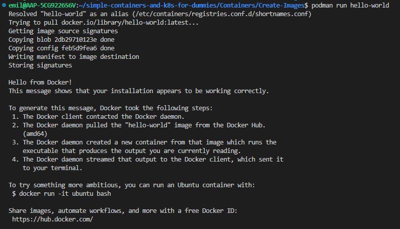
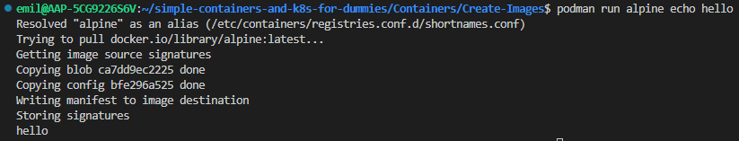
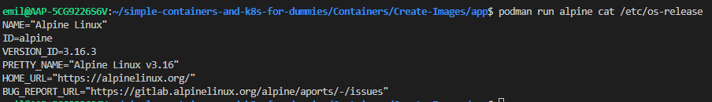
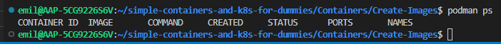
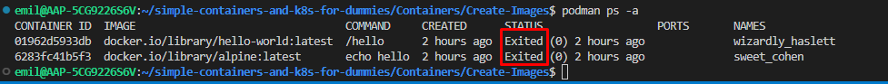
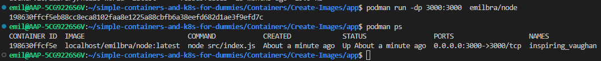
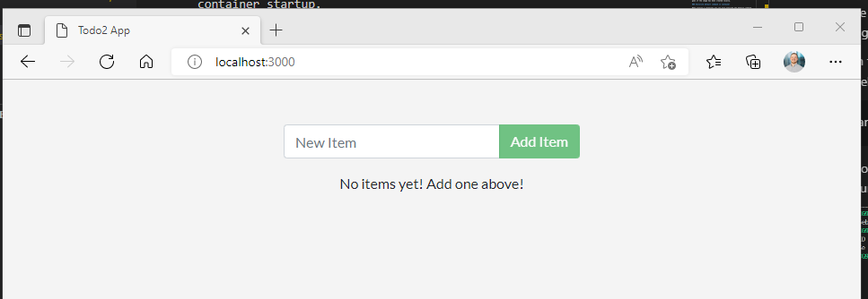
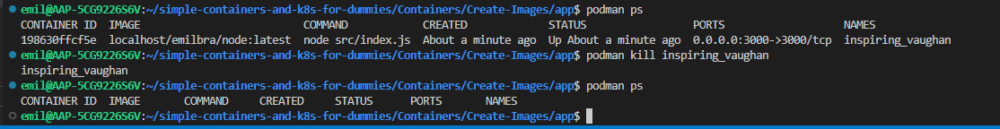

# How to run and manage Containers using Podman

We previously discussed what a Container is, now lets look into some simple usage.

## Run a container

This command runs a simple hello-world container, that simply prints some text to the terminal.

```Bash
podman run hello-world 
``` 



As we can see from the screenshot, podman is trying to pull the hello-world image from the central docker.io registry. If the image allready has been downloaded, this will not be necessary. The same goes if the image has been created locally.

Here, podman retrieves the image from Docker Hub.

### Overwrite default command in container

When running a container you can also override the default command.
This wont work for  the hello-world image, since it does not contain anything else than an executable that prints the message to our terminal, resulting in an error if overwritten.

Alpine linux has a little more we can do with it, since it is a linux distribution:

```Bash
podman run alpine echo hello
```



As seen, the command ```echo hello``` is run on container startup.

In the same way, we can examine the OS by running this:

```Bash
podman run alpine cat /etc/os-release
```

resulting in this output:



As we can see, the Alpine image stored in Docker hub is running Alpine Linux v3.16.

## Managing Containers with podman

Both the hello-container and the container with Alpine linux exited after having run its command.

We can examine if this is the case by making use of the ```podman ps``` command

```Bash
podman ps
```



```podman ps``` shows all containers on the system. By default this only includes the *running* containers, which explains why neither of our containers from before shows up.

We can ovveride this default behaviour by running ```podman ps -a```, with "-a" meaning all.

This shows us all containers, including containers with status "Exited"



Notice that podman ps also shows uss the commands that were run at container startup.

## Run a specific container version

Notice how we never declared a version or tag when running our containers earlier.

If nothing is defined, the containter tagged with "latest" will be used by default. To choose a specific tag, the following command would be used instead:

```Bash
podman run alpine:edge
```

or

```Bash
podman run alpine:3.16.3
```

Both of these results in us running a specific tag (usually a different version). Available tags can be viewed in the image's docker hub listing, [here](https://hub.docker.com/_/alpine/tags).

### Kill running containers

So far we had only run containers that exit immediately that their command has finished executing.

If we run the container we create in [this chapter](Create-Images.md), we see that the container has status running indefinitely.

```Bash
podman run -dp 3000:3000 emilbra/node
```

Note also that we used -d here, to run the container as detached, meaning it runs in the background.



Remember, the todo-app featured should look like this:



The command the container runs on startup is going to run until an error occurs, or we  choose to manually kill it.

We can kill the container by referencing its automatically generated name

```Bash
podman kill inspiring_vaughan
```



## Documentation

For more, please reference podmans official documentation:
<https://docs.podman.io/en/latest/markdown/podman-run.1.html>

## Bonus: run a container interactively

By default containers run non-interactively, and they should. Sometimes however it is usefull to get a shell into a 