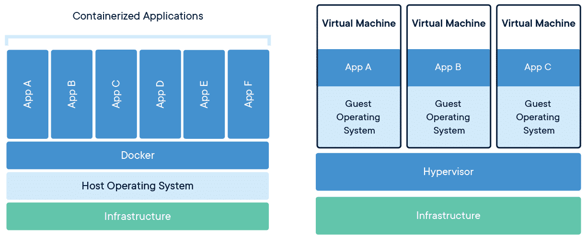

# What is a Container?

Put very simply, a container is a self-contained unit of software that contains all dependencies and code required to run itself.
It is therefore not dependent on underlying hardware or software, making containers portable, as well as quick and easy to run.

A key positive with this is that containers can run the same way, no matter where they are run. This if for example usefull in keeping Development and Production environments consistent.

This could be a web-server running a guestbook (which we will show off later), or it could be a service run as an response to an external event. Just to name a few examples.

Its usefull to allready at this point emphasise the distinction between a Container and a Container Image.

- A Container Image is something that we prepare beforehand. It is a read-only file that can be used to create a container. It is in practice a "snapshot" of a environment, providing an immutable way to run sofware the same way every time it is run. We will look into how to create an image in the next chapter.
- Only when we run this image, the concept of a Container is created.

Since the image is immutable, doing changes to the container is done by creating a new image.
Instead of entering the container and doing manual changes, we are forced to version and iterate over container images.

The way the Build-process function for container images makes this way less tedious than this sounds, which we will explore soon.

In practice a Container Image can contain as much, or as little, as its developers want.

## Containers vs Virtual Machines

Containers are not the same as a VM. They have different uses, and function in different ways.

And it should be said that, while the market trends overwhelmingly towards containers, Virtual Machines still have their own place in a Cloud Architecture.

*Figure in courtesy  of docker inc <https://www.docker.com/resources/what-container/>*

In containerization, containers make use of the Operating system of the underlying host. Most commonly this is Linux. This means that Containers use the same kernel and binaries as the operating system, and dont need to install or set this up for their separate instances. This means that Containers are really lightweight, and dont contain any unecessary 'stuff'.

For Virtual Machines, the whole Operating System is instead virtualized separately for each instance. Running 3 Windows Servers on a Virtualization platform, means that we in practice have three separarate Windows Server Operating Systems running on the Platform. Thats not really efficient, if we dont need it.

Containers are well suited for running applications in a microservices-pattern, and they reduce overhead and resource consumption. They are very lightweight and start up really quickly.
Additionally, since a container only contains its dependencies, a container is more reliable and easy to troubleshoot since it is made for a specific purpose. The way that containers are isolated also avoids interference from another process or service on the system crashing the instance.

## Read further to learn about "Cattle, not Pets"

[cattle, not pets](Cattle-Not-Pets.md)