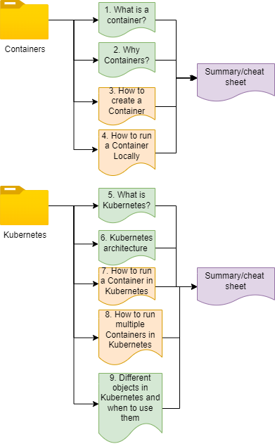

# Starting off

This Repository is meant as a super simple introduction to Containerization and Kubernetes.
In other words, this tutorial is not in any way meant to be exhaustive, but an introduction that should help you understand core concepts. You could start here, but there is so much more to learn!

## Learning Goals

After going through this this tutorials contents, you should know about these key topics:

1. What is a Container?
2. What is a Container Image?
3. How are Containers created?
4. What is Kubernetes?
5. Kubernetes architecture.
6. Some of the Managed Kubernetes Offerings

As well as working knowledge of these practical tasks:

1. How to run a Container locally
2. How to run a Container in Kubernetes
3. How to a run a set of Containers as a Deployment in Kubernetes.
4. Distinguish between the different Managing Kubernetes-objects.

## Repository Contents:

This diagram shows the contents of this repository

